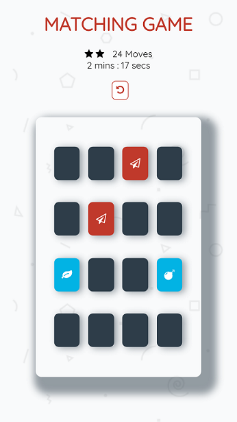

# Memory Game Project
a javascript memory game

## Table of Contents

* [Important!](#important)
* [How to play?](#how-to-play)
* [Code depencies](#code-depencies)

## Important

- Made as a part of Udacity's Front-End Web Developer Nanodegree Program.
- Uses starter code provided by [Udacity](https://github.com/udacity/fend-project-memory-game) 

## How to play

- Clicking on tiles will turn them over so that you can see what lies on them.
- Your goal is to match two tiles of the same type at a time.
- Then try to match all pairs in as minimum moves as possible.

- 

## Code depencies
- [JQuery](https://jquery.com/) 
- [Sweet Alert](https://sweetalert.js.org/guides/) 
- [Google Fonts](https://fonts.google.com/) 
- [Font Awesome](https://fontawesome.com/)
